# Compound Lifts


## Required Development Setup

* Use the following command to install all the dependencies from 'sourcecode/server/requirements.txt':

```sh
(Python 2.x) > pip install -r requirements.txt 
(Python 3.x) > pip3 install -r requirements.txt

```

## Usage

Once all of the dependencies have been installed:
* Create and setup a 'defaults.py' file in the config directory (example file included)
* Set current directory to <b>/sourcecode/</b>
* Set the Flask App: <b>$env:FLASK_APP="run.py"</b>
* Run the Server: <b>flask run</b>
* Setup complete! You should see the success message as shown in the image below
* Go to http://localhost:5000/ to access the site

![running]

## Screenshots

Sign Up and Login:

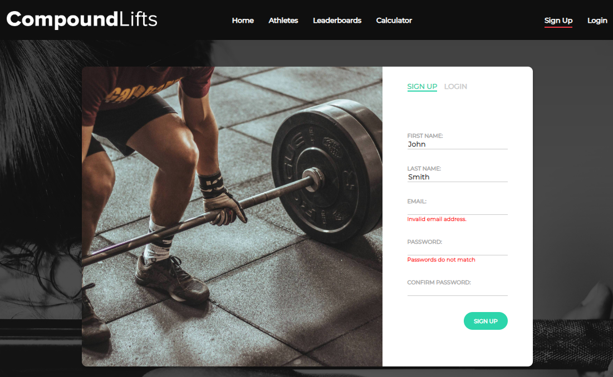
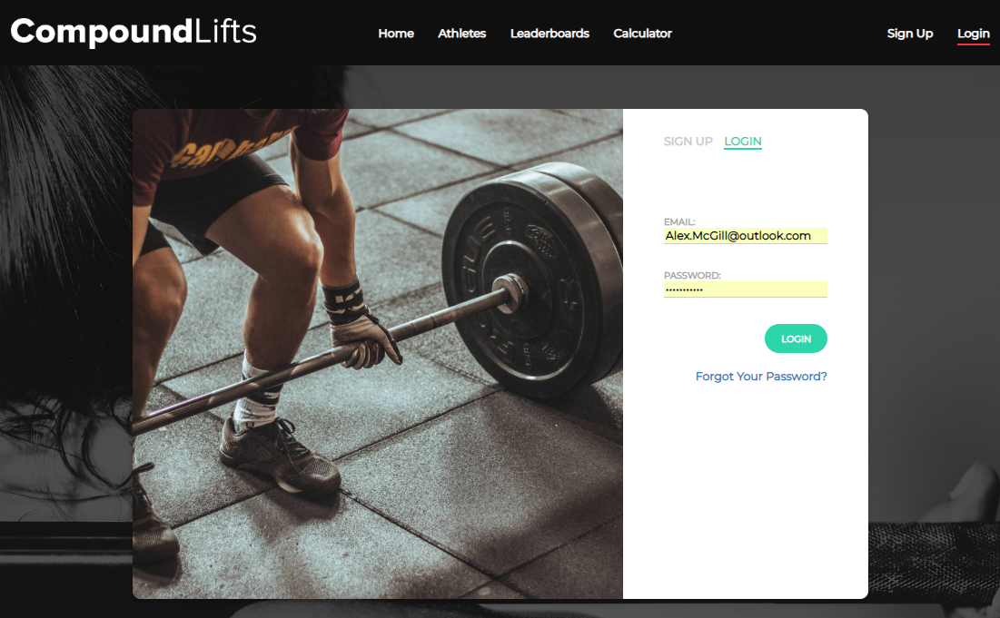


Activity Feed:

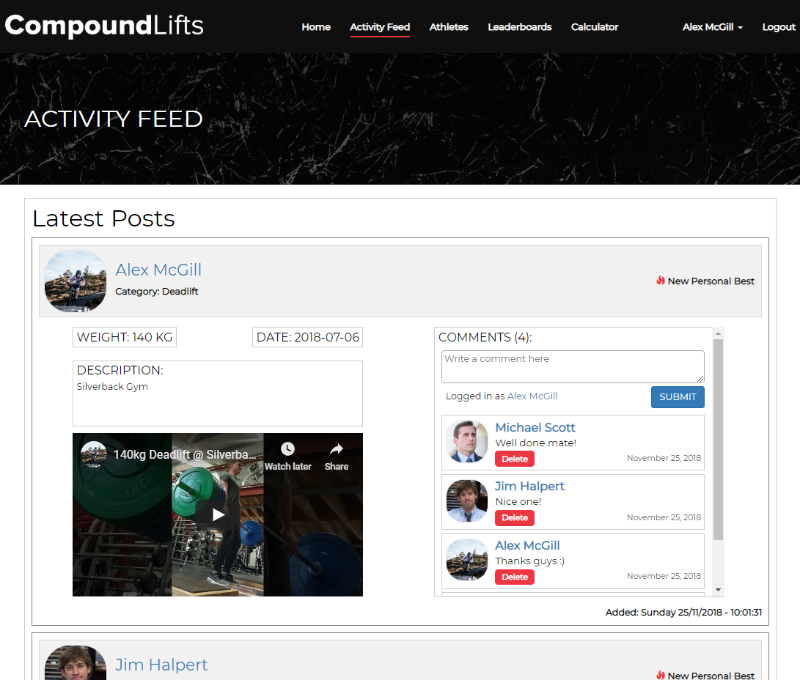

Athletes List and Search Interface:

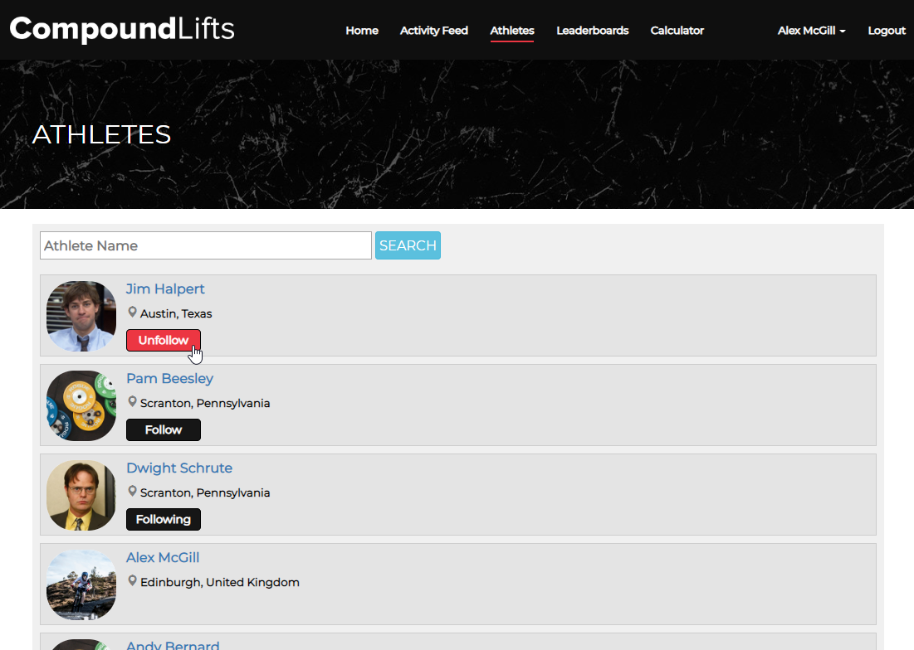

Athlete Pages:


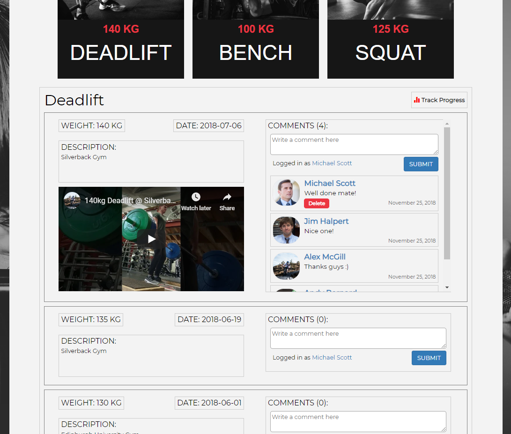
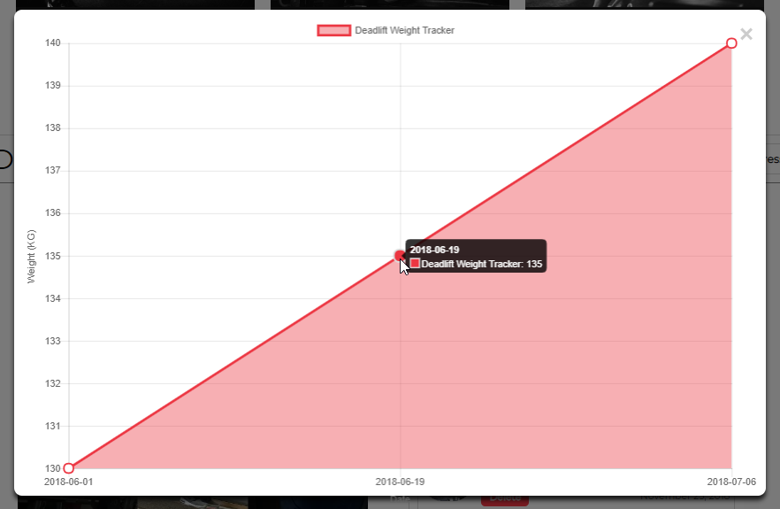
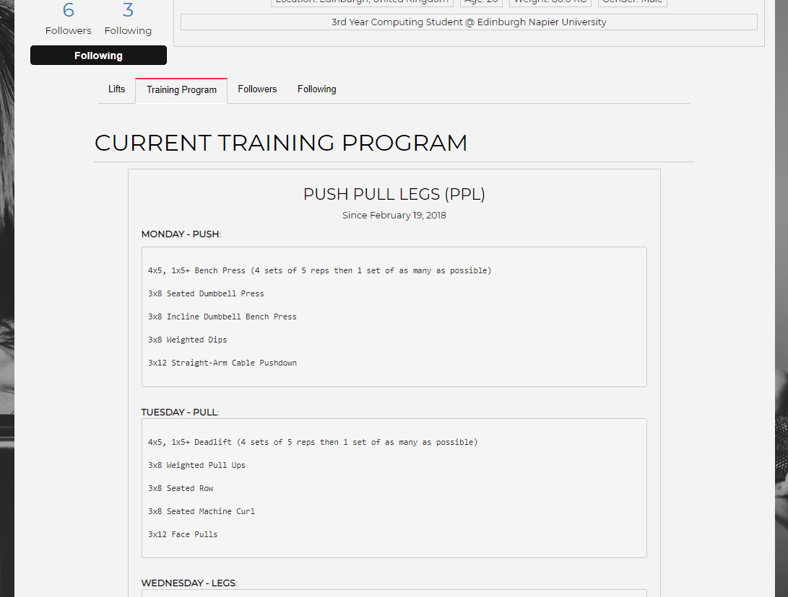
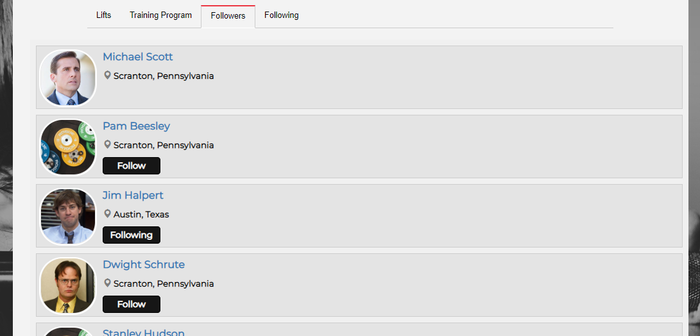
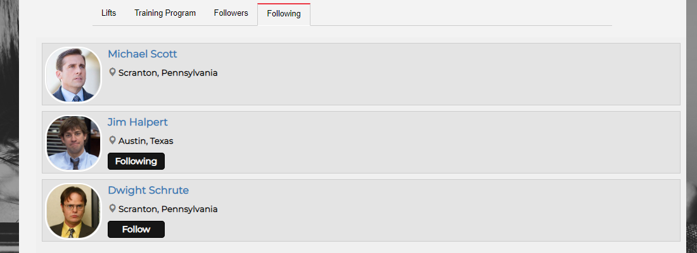

Leaderboards:

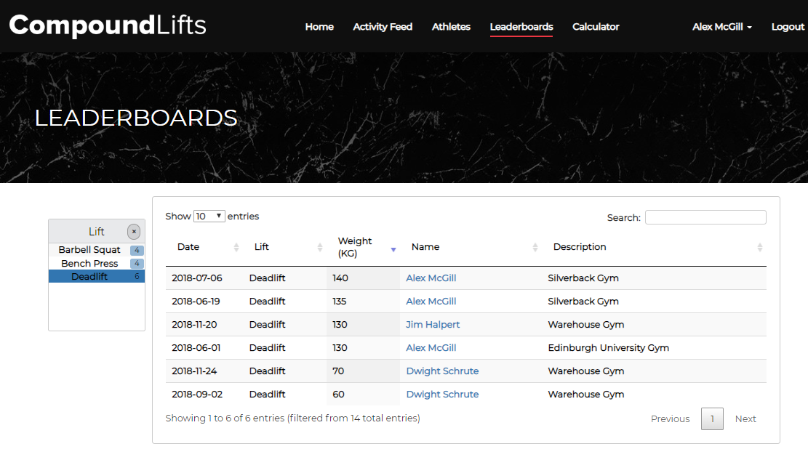

One Rep Max Calculator:

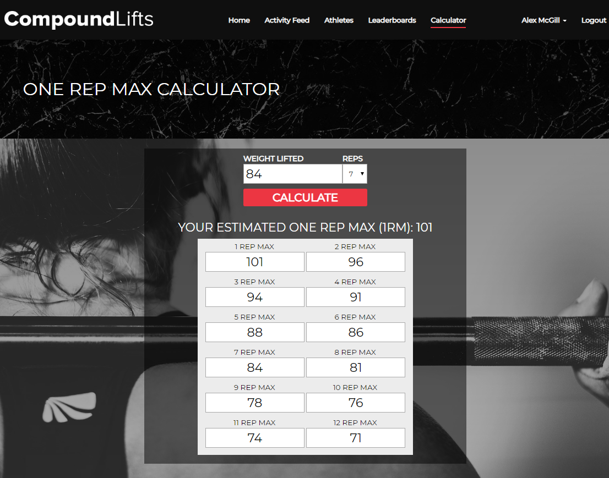

Add / Edit / Delete Lifts:


Edit Profiles:

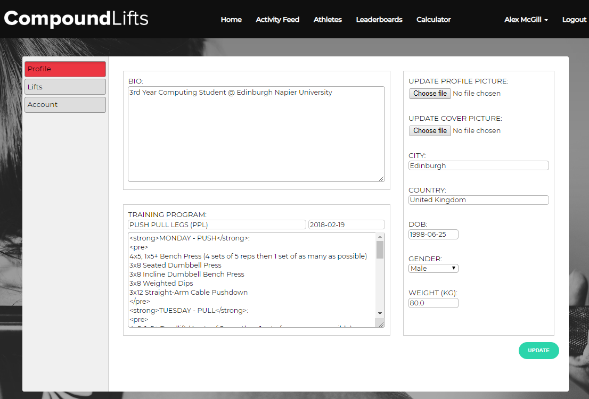

Reset Password:


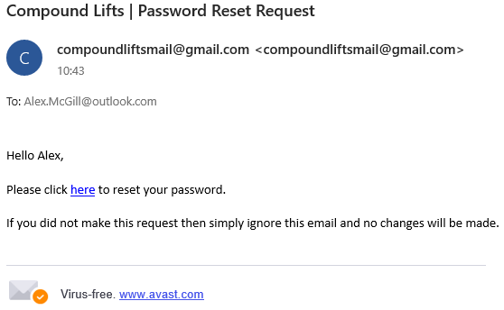

## Meta

Distributed under the [MIT license](https://choosealicense.com/licenses/mit/). See ``LICENSE`` for more information.

Author [@mcgill-a](https://github.com/mcgill-a)

<!-- Markdown link & img dfn's -->
[running]: https://i.imgur.com/keoeAmQ.png
